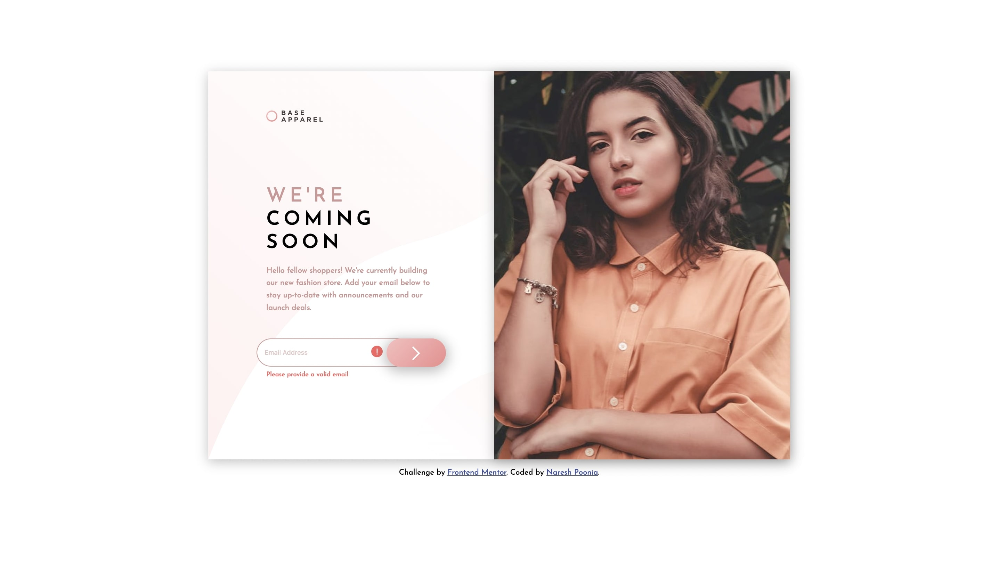

# Frontend Mentor - Base Apparel coming soon page solution

This is a solution to the [Base Apparel coming soon page challenge on Frontend Mentor](https://www.frontendmentor.io/challenges/base-apparel-coming-soon-page-5d46b47f8db8a7063f9331a0). Frontend Mentor challenges help you improve your coding skills by building realistic projects.

## Table of contents

- [The challenge](#the-challenge)
- [Screenshot](#screenshot)
- [Links](#links)
- [My process](#my-process)
  - [Built with](#built-with)
  - [What I learned](#what-i-learned)
  - [Continued development](#continued-development)
  - [Useful resources](#useful-resources)
- [Author](#author)
- [Acknowledgments](#acknowledgments)

### The challenge

Users should be able to:

- View the optimal layout for the site depending on their device's screen size
- See hover states for all interactive elements on the page
- Receive an error message when the `form` is submitted if:
  - The `input` field is empty
  - The email address is not formatted correctly

### Screenshot

### Links

- Solution URL: [Solution URL](https://github.com/nareshpoonia/base-apparel-project)
- Live Site URL: [Live site URL](https://serene-villani-ae9cf9.netlify.app/)

### Built with

- Semantic HTML5 markup
- Flexbox
- Mobile-first workflow

### What I learned

I learned about SVG, WCAG, Box Shadow, How to validate an email in JS

### Continued development

I would like to get better in making the images responsive

## Author

- Website - [Naresh Poonia](https://www.nareshpoonia.com)
- Frontend Mentor - [@nareshpoonia](https://www.frontendmentor.io/profile/nareshpoonia)
- Twitter - [@naresh*poonia*](https://twitter.com/naresh_poonia_)

## Acknowledgments

[Jai Pandya](https://twitter.com/jaipandya) reviewed the code and helped me fix the issues
